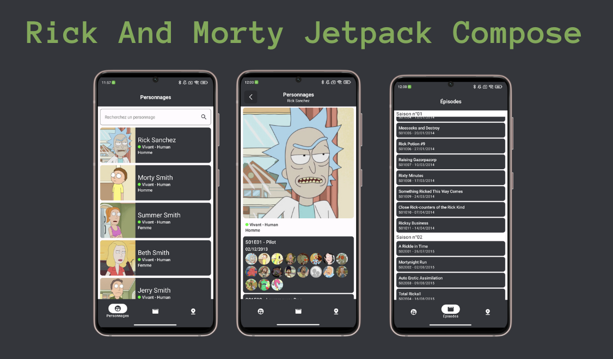

<h1 align="center">Rick And Morty Jetpack Compose</h1>


<p align="center">

</p>

<p align="center">
  
     
        

  
</p>

## Architecture générale


### Couche présentation


#### MainActivity

La couche présentation contient toutes les features de l'application (login, main etc...). À la racine du package **presentation** on peut voir [MainActivity](./app/src/main/java/fr/thomasbernard03/rickandmorty/presentation/MainActivity.kt). Nous utilisons une application en Single Activity. Nous auront donc une seule et unique Activité. Dans cette activité nous déclarons notre Scaffold et notre seul NavHost. C'est donc au sein de ce Scaffold que la navigation sera effectuée.

Dans cette Activity nous injectons notre `navigator : Navigator`, cette instance de Navigator va nous permettre d'écouter toutes les navigations effectuée dans l'application et les répercuter sur notre navController. Cette classe nous permet d'effectuer la navigation directement depuis nos ViewModels.

Nous injectons aussi notre `errorHelper: ErrorHelper`. Tout comme pour le navigator, nous nous abonnons à cette instance pour pouvoir afficher les messages d'erreur en utilisant le snackbarHostState de notre Scaffold. Nous avons créé ce ErrorHelper pour éviter de passer des callback dans chacun de nos screens pour afficher des messages d'erreurs.


### Screen

Les screen sont des fonctions composables qui définissent l'affichage de nos écrans. Chaque Screen prend un State en paramètre et un callback onEvent(). Nous pouvons donc personnaliser nos Previews en modifiant le state. Les previews sont des fonctions composables privées situées en bas de page.

```kotlin
@Composable
fun LoginScreen(uiState : LoginUiState, onEvent : (LoginEvent) -> Unit){

}
```

### UiState

Les UiState sont des dataclass contenant toutes les données de nos écrans qui peuvent changer. Toutes les propriétés de ces states doivent être immutables et doivent donc être changées en updatant le state tout entier. Les states sont modifiés dans le ViewModel de cette manière :

```kotlin
private val _uiState = MutableStateFlow(LoginUiState())
val uiState: StateFlow<LoginUiState> = _uiState.asStateFlow()

private fun onLogin(username : String, password : String){
    _uiState.update { it.copy(loading = false) }
}
```

### Event

Les event sont des SealedClass qui contiennent toutes les actions que le Screen peut déclencher. Ces actions sont traités dans le ViewModel :

```kotlin
sealed class LoginEvent {
    data object OnAppearing : LoginEvent()
    data class OnLogin(val username : String, val password : String) : LoginEvent()
}

fun onEvent(event : LoginEvent){
    when(event){
        is LoginEvent.OnAppearing -> onAppearing()
        is LoginEvent.OnLogin -> onLogin(event.username, event.password)
    }
}
```

### ViewModel

Le ViewModel est la pièce centrale de la couche présentation. Ces classes **handle** traitent tous les évenements propagés par l'interface utilisateur (Screen) et mettent à jour le state (UiState). Pour certaines méthodes, nous pouvons lancer des coroutines en utilisant le viewModelScope. Cela permet d'executer de longues tâches sans bloquer l'interface utilisateur.


### Package components

Le package components ne contient que des fonctions composables. Ces dernières doivent être le plus simple et réutilisables possibles. Ces composants peuvent être triés par feature si ils ne sont utilisés que dans une seule et même feature. Ces composants doivent avoir des preview, cela permettra de les reconnaitre et de les tester très facilement.

## Couche domain

La couche domain est séparée en 3 packages principaux :


### Models

Les models sont des classes contenant les données prêtes pour l'affichage. Elle ne doivent pas contenir d'annotations dépendantes de la couche data. 


### Repositories

Ce packages contient uniquement les interfaces de nos Repositories (Couche Data). Ces interfaces doivent définir le comportement de nos implémentations


### UseCases

Les UseCases contiennent les cas d'utilisation de notre application, c'est notre logique métier. Dans nos usecases nous injections nos repositories (Leurs interfaces). Ces UsesCases doivent surcharger l'opérateur invoke. Ils contiennent donc une seule méthode publique.

```kotlin
class LoginUserUseCase(){
    suspend operator fun invoke(username : String, password : String){ }
}
```

De cette manière nous pouvons alors appeler notre use case comme cela :

```kotlin
// Ici notre use case est injecté dans notre ViewModel
val loginResult = loginUseCase(username, password)
```

La plupart des usecases retournent un Type Resource. Cela permet de gérer facilement les erreurs dans nos ViewModels et d'afficher des messages d'erreurs parlant pour l'utilisateur. Les uses cases ne lèvent donc pas d'exception. Ils doivent catcher ces dernières.


## Couche data

La couche data 